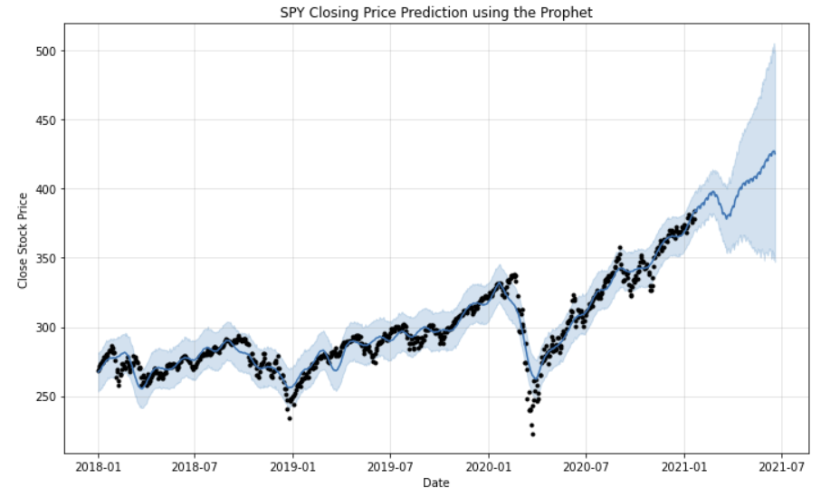

# SPY Time Series Analysis
## Purpose
The SPDR S&P 500 Trust TEF, also know as SPY,  is a publicly traded ETF that aims to tracks the overall combined performance of the Standard & Poor 500 index. SPY is one of the most popular and heavily traded EFT’s in todays market and is considered a great indicator for overall market trends.  This project will use various machine learning techniques to conduct a time series analysis on SPY in attempts to accurately predict closing prices.  

## Data
The data use for this project was acquired from the Yahoo! finance API. I will be using multiple time frames throughout the project for various comparisons.  

## Models
- ARIMA
- FB Prophet
- KNN Regressor
- Gaussian Process Regressor
- Support Vector Regressor
- Random Forset Regressor
- XGBoost
- Long Short Term Memory (LSTM)

## Results
### ARIMA 
This ARIMA model was tuned for optimal parameter selection. Although it did not predict the closing price accuracy it was able to plot the overall market direction using 3 years of data. This linear based model had a difficult time taking the covid crash into consideration.    

### FB Prophet
FB Prophet is a model that was created to take into account seasonality and was extremely effective for plotting general trends.  This model is predicting 150 days into the future where the black dots are real data points and the blue line is the prediction. The blue shadow is the confidence interval of 95%.  The model can also plot seasonal, weekly and daily trends shown below. 

### REGRESSIVE ML MODELS
When comparing KNN, gaussian process, support vector, and random forest regressors along with XGBoost, the random forest regressor model performed the best with a RMSE of 1.62. The image below shows a comparison of each model. These models were all trained on data from the previous 30 days of trading using 5 minute increments. 

### LSTM
The long short-term memory or LSTM performed the best in my analysis for SPY with a RMSE of .66.  LSTM’s are an improved version of recurrent neural networks. While RNN’s can only connect recently perceived information they have a difficult time connecting as the time gap grows.  This is where LSTM’s are useful as the have the ability to remember information over a much larger period of time. This is illustrated in the chart below for the same time period as the pervious models, 1 month of data in 5 min increments. 

## Conclusions and Further Wroks

This project has led me to the conclusion that LSTM models can be a very useful tool when predicting the future movements of stocks. As you can see in the charts below the same LSTM model was able to accurately predict on multiple time frames. The first is a 3 year daily chart which produced a RMSE of 5.93 and the second is a 1 day/1min chart which resulted in a RMSE of .352. 

Moving forward I do believe that these models can be useful when considering the overall momentum and trend of a stock or ETF. I do believe they can be more useful on a ETF such as SPY as it is comprised of an aggregate of an entire index and does not been the fundamental analysis that would go into a company. 